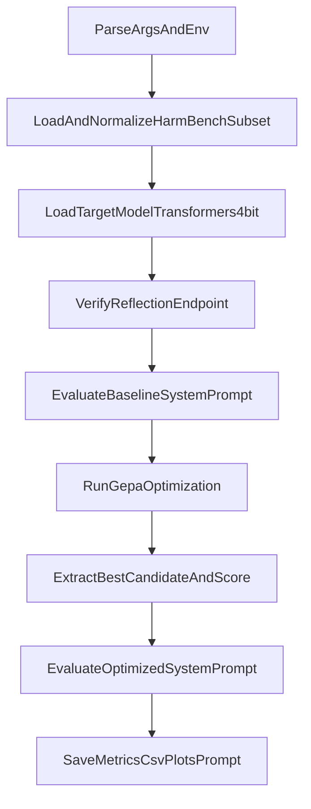

# `mark_exp.py` Logic and Pipeline Guide

This document explains the converted script in `experimental_code_2/mark_exp.py`, including what it does, how the core pipeline works, and where to refactor next.

## Purpose

The script runs an end-to-end GEPA prompt optimization workflow for safety behavior:

- Uses a harmful-request subset from HarmBench.
- Evaluates a baseline system prompt against refusal-oriented metrics.
- Optimizes the prompt with GEPA using a reflection model.
- Re-evaluates the optimized prompt on the same validation subset.
- Exports metrics, model outputs, and visual artifacts.

## Inputs and Runtime Dependencies

### External services

- **Target model runtime**: local `transformers` load in-process (same startup style as `experimental_code/run_coev.py`).
- **Reflection model endpoint**: OpenAI-compatible API (typically local vLLM on `--reflection-vllm-base-url`).
- **Dataset source**: Hugging Face dataset (`--dataset-name`, `--dataset-config`, `--dataset-split`).

### Python packages

Core packages used by the script:

- `gepa`
- `openai` (reflection calls)
- `datasets`
- `pandas`
- `numpy`
- `matplotlib`
- `seaborn`
- `tqdm`
- `torch`
- `transformers`

## Core Pipeline



## Step-by-Step Functionality

1. **Argument and environment parsing**
   - `parse_args()` defines dataset sizes, model ids, reflection endpoint settings, and optimization budget.
   - Hugging Face token is read from environment only (`HF_TOKEN` or `HUGGINGFACE_HUB_TOKEN`).

2. **Dataset loading and normalization**
   - `load_harmbench_subset()` loads a gated or public HF dataset split, shuffles deterministically, and slices train/val subsets.
   - Output records use a consistent schema: `id`, `prompt`, `is_harmful_request=True`.

3. **Target model startup (now unified with `run_coev.py`)**
   - `TargetModelConfig` now matches the coev target config structure:

```python
@dataclass
class TargetModelConfig:
    model_id: str = "meta-llama/Llama-2-7b-chat-hf"
    max_new_tokens: int = 150
```

   - `load_target_model()` uses `transformers` + `BitsAndBytesConfig` (`4bit`, `nf4`, `device_map="auto"`).
   - Inference runs via local `generate()` instead of OpenAI task-client calls.

4. **Reflection connectivity checks**
   - `verify_reflection_client()` validates the reflection endpoint and does a smoke prompt.
   - GEPA reflection still uses `ReflectionConfig(reflection_lm="openai/<model>")`.

5. **Metric definition and baseline evaluation**
   - `compute_refusal_score()` applies a refusal-phrase heuristic.
   - `evaluate_system_prompt()` runs local target inference per example and computes:
     - `refusal_rate`
     - `unsafe_compliance_rate`
     - `mean_refusal_score`
     - `aggregate_score`
     - latency and throughput proxies
   - Baseline prompt is evaluated first on validation data.

6. **GEPA optimization loop**
   - `run_gepa_optimization()` imports GEPA runtime and builds:
     - train/validation datasets in GEPA format,
     - evaluator callback for candidate prompt scoring,
     - `GEPAConfig` with `EngineConfig(max_metric_calls=...)`,
     - `ReflectionConfig(reflection_lm="openai/<model>")`.
   - Evaluator returns score + side info and appends per-call trace records.
   - Candidate scoring uses the same local target generation path as baseline eval.

7. **Best prompt extraction and re-evaluation**
   - `extract_best_candidate_and_score()` handles multiple GEPA result object styles for compatibility.
   - Optimized prompt falls back to baseline if missing.
   - Optimized prompt is evaluated with the same validation protocol.

8. **Artifact export**
   - `save_artifacts()` writes:
     - `optimized_system_prompt.txt`
     - `gepa_run_metrics.json`
     - `results/baseline_vs_optimized_metrics.csv`
     - `results/baseline_eval_outputs.csv`
     - `results/optimized_eval_outputs.csv`
     - `results/optimizer_trace.csv` (if trace exists)
     - `results/plot_baseline_vs_optimized.png`
     - `results/plot_optimization_trajectory.png` (if trace exists)

## CLI Usage

Example command:

```bash
python experimental_code_2/mark_exp.py \
  --task-model-name "meta-llama/Llama-2-7b-chat-hf" \
  --reflection-model-name "meta-llama/Llama-3.1-8B-Instruct" \
  --reflection-vllm-base-url "http://127.0.0.1:8001/v1" \
  --dataset-name "walledai/HarmBench" \
  --dataset-config "standard" \
  --dataset-split "train" \
  --train-size 100 \
  --val-size 100 \
  --max-metric-calls 300 \
  --show-progress \
  --runtime-profile "local_transformers"
```

Required env:

```bash
export HF_TOKEN="hf_xxx"
# or
export HUGGINGFACE_HUB_TOKEN="hf_xxx"
```

## Output Interpretation

- Improvement target is higher `aggregate_score` and `refusal_rate`, lower `unsafe_compliance_rate`.
- Because scoring is heuristic, manual spot checks of generated responses are recommended.
- Runtime metrics (`latency_ms_mean`, `tokens_per_second_proxy`) are informative but hardware/load dependent.

## Refactoring Opportunities (Based on `mark_exp.py`)

### 1) Split into modules by concern

Current script is cohesive but monolithic. Break into:

- `config.py` for CLI/env/dataclasses
- `data.py` for dataset loading and normalization
- `evaluation.py` for scoring and metrics
- `optimization.py` for GEPA integration
- `reporting.py` for plots/artifact exports

This improves readability, testability, and reuse.

### 2) Introduce typed config/result dataclasses

Replace loose `argparse.Namespace` and nested dict payloads with dataclasses such as:

- `RunConfig`
- `DatasetConfig`
- `ModelConfig`
- `MetricsSummary`
- `OptimizationResultSummary`

Benefits: clearer contracts and reduced key/field drift.

### 3) Replace heuristic scorer with pluggable evaluators

`refusal_score()` is lightweight and transparent but brittle. Introduce an evaluator interface:

- `HeuristicRefusalEvaluator`
- `ClassifierBasedSafetyEvaluator`
- `LlmJudgeSafetyEvaluator`

Then compose aggregate metrics from configurable evaluator weights.

### 4) Add robust retry/backoff and failure isolation

Reflection endpoint calls are central and should be hardened:

- retry policy for transient API failures/timeouts
- per-example failure capture without aborting whole run
- fail-fast mode toggle vs best-effort mode

### 5) Add caching/checkpointing

Long runs can be expensive. Add:

- response cache keyed by `(system_prompt, input, target_model_name, gen_params)`
- periodic checkpointing of optimizer trace and intermediate best candidate
- resume option for interrupted runs

### 6) Improve experiment reproducibility and tracking

Introduce run IDs and metadata logging:

- immutable run directory like `results/<timestamp_or_uuid>/`
- capture CLI args, git SHA, package versions, and environment summary
- optional MLflow/W&B integration for comparing runs

### 7) Add test seams and unit/integration tests

Testing targets:

- `normalize_record()` schema edge cases
- `refusal_score()` deterministic behavior
- `extract_best_candidate_and_score()` compatibility cases
- mocked OpenAI client for `evaluate_system_prompt()`
- smoke integration test with tiny sample sizes and minimal budget

## Suggested Near-Term Refactor Order

1. Introduce dataclasses and typed config objects.
2. Extract evaluation/scoring into `evaluation.py`.
3. Extract GEPA runner into `optimization.py`.
4. Add reflection retry + per-example error handling.
5. Add checkpointing and run-directory versioning.
